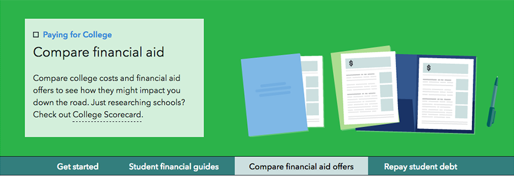

[](https://travis-ci.org/cfpb/college-costs) [](https://coveralls.io/github/cfpb/college-costs?branch=master)

# Paying for College
Tools to help students make informed financial decisions about college.



- **Status**:  Alpha
- This project is under construction. Please wear a hardhat.

### Setup dependencies
 * [solr](http://lucene.apache.org/solr/)
 * [pip](https://pypi.python.org/pypi/pip)
 * [virtualenv](https://virtualenv.pypa.io/en/latest/)
 * [virtualenvwrapper](https://virtualenvwrapper.readthedocs.org/en/latest/)
 * [node](http://nodejs.org/)
 * [gulp](https://github.com/gulpjs/gulp/blob/master/docs/getting-started.md)

<!--  * [elasticsearch](https://www.elastic.co/products/elasticsearch) -->

### Code dependencies
- [Django](https://www.djangoproject.com/)
- [requests](http://docs.python-requests.org/en/latest/)
- [Unipath](https://github.com/mikeorr/Unipath)
- [haystack](http://haystacksearch.org/)
- [pysolr](https://github.com/toastdriven/pysolr)

<!-- - [django-haystack](http://haystacksearch.org/) -->

### Testing dependencies
- [mock](https://github.com/testing-cabal/mock)
- [coverage](https://coverage.readthedocs.org/en/latest/)
- [selenium](https://selenium-python.readthedocs.org/installation.html)
- [behave](http://pythonhosted.org/behave/)
- [PyHamcrest](https://pyhamcrest.readthedocs.org/en/V1.8.2/)

### Installation
This project is not fully functional, but feel free to give it a spin. Here's how:
- Install the setup dependencies if you don't have them.
- Go to the local directory where you want the project to be created, make a virtual environment, clone this repository (or your own fork of it).
```bash
mkvirtualenv college-costs
git clone https://github.com/cfpb/college-costs.git .
setvirtualenvproject
```
- Set up front-end resources and database assets:
```bash
./local_setup.sh
```

### Prepping solr
- If you want the college-search function to work (you know you do), you'll need to prep and fire up solr.  
Adust the `build_solr_schema` command to match your local installation of solr and your solr version number.   
The example is for a brew-installed solr, with brew using the user's home director as its Cellar site and solr version 4.10.2.  
Be sure you're in the projects root directory, `/college-costs/`:  
```bash
./manage.py build_solr_schema > ~/homebrew/Cellar/solr/4.10.2/example/solr/collection1/conf/schema.xml
solr start
```

The last step is to rebuild the solr index:
```
./manage.py rebuild_index --noinput
```

- After that finishes, fire up a local web server:
```bash
./manage.py runserver
```

The college-cost tools should show up at [http://127.0.0.1:8000/paying-for-college/](http://127.0.0.1:8000/paying-for-college/)

The app is set up to run as a component of CFPB's website, [consumerfinance.gov](http://www.consumerfinance.gov), so if you run it locally, some fonts and font-related icons may not load because of [Cross-Origin Resource Sharing](http://www.w3.org/TR/cors/) policies.


### Running tests
You can run python tests from the project root with this command:
```bash
./pytest.sh
```

To run JavaScript unit tests:

```bash
npm test
```

To run functional tests, **you need to make sure that you have version 4.0+ of Node.js**. Install/upgrade it using either `npm` or `brew`.

You'll also need webdriver-manager and protractor:

```bash
npm install -g webdriver-manager protractor
webdriver-manager update --standalone
```

To run the tests:

```bash
# start webdriver in a terminal tab:
webdriver-manager start
# if you're running it on a localhost, in a fresh tab:
python manage.py runserver
# and in a third tab:
protractor test/functional/conf.js
```

<!-- INCLUDE IN setup.sh
- Build the front-end requirements and the JavaScript files.

```bash
npm install
grunt Build
```

## Configuration

If the software is configurable, describe it in detail, either here or in other documentation to which you link.

## Usage

Show users how to use the software.
Be specific.
Use appropriate formatting when showing code snippets.

## How to test the software

If the software includes automated tests, detail how to run those tests. -->

## Getting involved

If you find a bug or see a way to improve the project, we'd love to hear from you. Add an issue, or fork the project and send us a pull request with your suggested changes.

----

## Open source licensing info
1. [TERMS](TERMS.md)
2. [LICENSE](LICENSE)
3. [CFPB Source Code Policy](https://github.com/cfpb/source-code-policy/)


----

## Credits and references

This project is based on the current [CFPB Paying for College](http://www.consumerfinance.gov/paying-for-college/) suite of tools for students.
